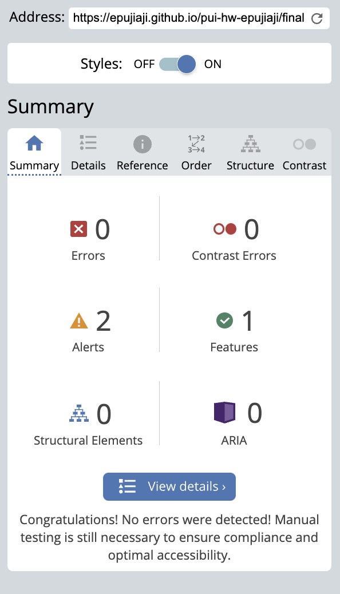
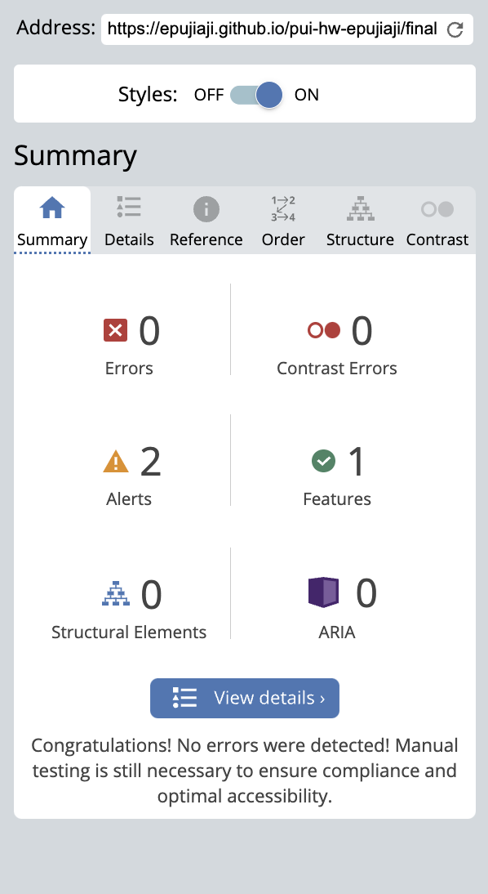
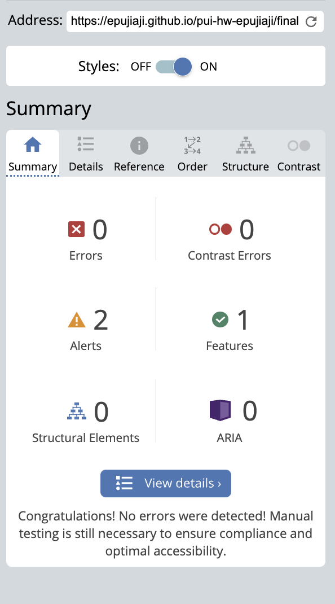
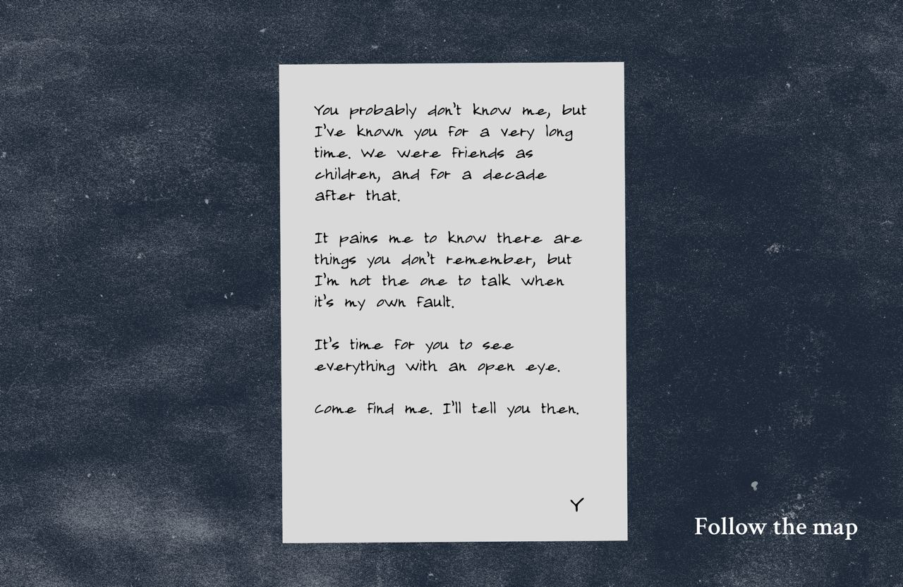

<mark>**Note that this document order from FP4 -> FP1**</mark>

<mark>Please sign up for the study</mark> at [https://tinyurl.com/pui-study](https://tinyurl.com/pui-study) to allow us to use your submission to create a better GenAI assistant for designers!

---

# **FP4 \- Final Project Writeup**

Feel free to refer to this [Markdown Cheat Sheet](https://www.markdownguide.org/cheat-sheet/) to make your writeup more organized, and you can preview your markdown file in VSCode [Markdown editing with Visual Studio Code](https://code.visualstudio.com/docs/languages/markdown#_markdown-preview). 

## Part 1: Website Description

Describe your website (300 words).

* My website, Letters for the Road, is an interactive choice-based text story. It is an experience where players navigate through the site and witness different narrative outcomes based on the choices they make. Immersion towards the story is strengthened through imagery and text animations, encouraging players to become engrossed with outcomes and how the story will end by the choices they make.
* The game is accessible to everyone, with no specific target demographic. It is especially suited for those who enjoy short stories and are looking for a brief escape from their busy lives. While it shares some similarities with graphic or visual novels, the game is designed to be approachable for all, regardless of prior gaming experience.
* The narrative includes several mini-branches that allow players to explore "detours" before looping back to the main storyline. Even if players need to restart from certain points, the story remains fully fictional and aims to entertain and amuse.
* The site integrates multiple interactions alongside an engaging narrative. Players make choices to move the story forward, supported by visual elements like background images that bring the setting to life. Additionally, "letters" appear as dynamic, interactive objects, creating the feeling of picking up and reading a real letter within the story.

## Part 2: User Interaction

How a user would interact with your website? For each step, briefly but clearly state the interaction type & how we should reproduce it.

1. Click on "Start Treading" on Index page.
2. Click on "Pick it up" or "Throw it away" on scene 1.
3. If choose "Throw it away", click "Pick it up" on scene 2.
4. If choose "Pick it up", click one of three options in scene 3:  "Call their mother", "Remind yourself what happened", or "Go to the woods".
5. If choose "Call their mother", clicking on "Wait" or "But" will direct player to scene 4a. No different outcomes.
6. After clicking "Wait" or "But", click "Try Again" in scene 4a to get redirected back to scene 3.
7. If choose "Remind yourself what happened", players can choose "Call their mother" or "Go to the woods", as well as 3 pages about more information: "Remember what they were like", "Recall what you did together", and "Reflect on how it happened"
8. Players can click "What else is there" to return to scene 5.
9. If choose "Go to the woods", Players can choose "Wait here in the fields" or "Go to the place you last met".
10. If choose "Wait here in the fields", players click "Sleep", then "Listen closely",  then "Wake Up". After that, they click "Try again".
11. If choose "Go to the place you last met", players click "Look down", "Look closely", "Pick it up", then "end" to finish game.
12. Upon the credits scene, players can click "Restart" to replay the game.

## Part 3: External Tool

Describe what important external tool you used (JavaScript library, Web API, animations, or other). Following the bulleted list format below, reply to each of the prompts.

1. Textillate  
   * Chosen for its simple implementation and extensive customization options, including control over display time, delay, autostart, looping, and synchronized or sequential text display.
   * Used to create text entrances and exits on each page, especially for interactive elements like clickable options.
   * Enhances emotional immersion in the story by contributing to the atmosphere. For instance, blinking or fading text reinforces the narrative's mellow tone and adds to the overall mood.
2. Animate
   * Similarly chosen for its simplicity and flexibility, with the added benefit of offering animations not available in Textillate, such as flash or shake effects. 
   * Utilized to implement text entrances and exits on each page through the addClass function in JavaScript for CSS styling.
   * Like Textillate, it elevates the atmosphere and mood of the story by adding stylish, mood-setting animations.

## Part 4: Design Iteration

The initial design for Letters for the Road was much simpler than its current form. Most of the changes focus on visual enhancements to bring out the themes and add style, making it a more immersive experience that strengthen emotional engagement toward the story. For example, I diversified text animations across pages to match the story—for instance, using "blinking" text to simulate eyes opening when waking up. I also introduced transitional pages where text fades in and out to create the feel of passing dialogue and a slower pace, encouraging users to engage rather than just click through. These transitions are featured in the prologue and ending scenes. Additionally, I added unique background images for each scene and implemented a rotating entrance for the letter container to mimic the action of picking up a letter.

## Part 5: Implementation Challenge

I initially had some hurdles implementing the various Textillate and Animate animations for each page, since each page is different. I also struggled with customizing the text entrances in detail, as I wanted to time certain texts to show up after others (for example, clickable options appearing after narration, or the letter showing up after narration). Timing the animations turned out to be the trickiest part. I also decided to use Animate after discovering that the Textillate library wasn’t exhaustive enough to achieve the effect I wanted.

## Part 6: Generative AI Use and Reflection

Describe how you used Generative AI tools to create this final project (fill in the following information, write \~500 words in total).

Document your use of all GenAI tools — ChatGPT, Copilot, Claude, Cursor, etc. using the template below. Add/Delete rows or bullet points if needed, and replace Tool1/Tool2 with the name of the tool.

### Usage Experiences by Project Aspects

Feel free to edit the column \_ (other?) or add more columns if there's any other aspect in your project you've used the GenAI tools for.

For the following aspects of your project, edit the corresponding table cell to answer:
- *Usage*: Whether you used / did not use this tool for the aspect. Enter [Yes/No]
- *Productivity*: Give a rating on whether this tool makes your productivity for X aspect [1-Much Reduced, 2-Reduced, 3-Slightly Reduced, 4-Not Reduced nor Improved, 5-Slightly Improved, 6-Improved, 7-Much Improved].

| Tool Name | Ratings | design | plan | write code | debug | - |
| :---- | :---- | :---- | :---- | :---- | :---- | :---- |
| ChatGPT | Usage | No | Yes | Yes | Yes | - |
| ChatGPT | Productivity | 4 | 7 | 5 | 6 | 4 |
| Gemini| Usage | Yes | No | No | No | - |
| Gemini | Productivity | 7 | 4 | 4 | 4 | 4 |

### Usage Reflection

> Impact on your design and plan 
* It matched my expectations and plan in [FP2](#generative-ai-use-plan) in that it helps 1. Suggest an optimum workflow for utilizing both Textillate and Animate, 2. Debugging troubles in my code, and 3. Clarifying whether the changes I want to make is feasible with my current code. For example, 
  1. ChatGPT: I had trouble initializing both libraries and implementing them, as I didn’t find the documentation for either particularly helpful, especially for beginners. ChatGPT helped me understand what to do and made sure the libraries were accessible. When I encountered errors, I shared snippets of my problematic code to troubleshoot, as I often have difficulty pinpointing where things go wrong. I also asked ChatGPT whether it was possible to make specific changes, such as customizing the entrance timing for different text elements on one page that would show up again on another page with the same class identifier. Sometimes, it's tough to find exact use case examples online, which is where I find ChatGPT especially useful. I can describe my situation and get faster troubleshooting results. It also suggests best practices and helps me avoid mistakes, like when overlapping functions might block certain functionality.
* It also matched my expectations and plan to help create assets to use as backgrounds when I need something deeply specific but cannot find a free resource on the internet. For example, 
  1. Gemini: I am able to give it very specific atmospheres and mood I was going for, and even when it does not fulfill my expectations, I can give a reference image and point out which aspect I want it to replicate; such as the color palette, image style, and angle. This greatly helps me in making assets that does not only fit the setting, but also layouted in a way that does not block the text placement in the screen.

* It did not match my expectations and plan in [FP2](#generative-ai-use-plan) in that as I ended up comparing the code it generated to the code I had written on my own. For example, 
  1. ChatGPT: ChatGPT didn’t effectively suggest revisions and often made style decisions that altered the structure I had already implemented. Instead of being helpful, it made my code more complex. I found that comparison was a more useful approach for me to get the answers I needed. I let ChatGPT show what it would do on its own, then I adjusted my own code accordingly, sticking to the structure I had. This method proved to be much more effective in solving problems.
* GenAI tool partly influenced my final design and implementation plan, as I used it to refine my plans and make them more effective. However, I also stuck closely to my original vision and didn’t let its limitations block me. For example, 
  1. ChatGPT: It helped me improve the effectiveness of my code. For example, it suggested ways to structure my `head` tag to ensure all scripts for the library were referenced correctly. While this was a technical adjustment, the original design remains entirely my own.
  2. Gemini: It’s just used as a supporting tool to enhance the visuals and style. I had a clear vision in mind for what I wanted the background to look like, and even when the results didn’t quite meet my expectations, I reprompted multiple times to get as close as possible to the outcome I envisioned.

> Use patterns
* I accepted the suggestions when they made sense and didn’t disrupt my existing code structure.  For example, 
  1. ChatGPT: This tool once suggested adding a function to create a page background fade-in effect to my JS file. I adjusted my design based on the suggestion because it found an ideal placement for the function that didn’t interfere with my other existing functions. On other cases, I wanted text elements to show up one after another, and it proposed using a setTimeout function for each text ID. This approach was logical and worked perfectly, so I followed it.
* I critiqued/evaluated the generated suggestions by reprompting or adding constraints, ensuring they fit my existing setup. For example, 
  1. ChatGPT: It once suggested adding extra containers to adjust how a flexbox looked. However, I rejected the idea because it introduced unnecessary margins and padding, making the site look off-center and inconsistent with my original layout.
  2. Gemini: It generated a background based on my literal prompt, but the style was inconsistent with the rest of the visuals. I provided a reference image, which helped it create something more aligned.

> Pros and cons of using GenAI tools
* Pros
  1. ChatGPT: Great for troubleshooting specific use cases, checking code, and making adjustments rather than rewriting everything from scratch. It’s granular and remembers previous class/ID names for continuity.
  2. Gemini: Produces refined and detailed image styles, especially when given precise prompts or reference images.
* Cons
  1. ChatGPT: Often changes code without considering the context, lacks awareness of repositories, and provides overly lengthy responses that require effort to scan for quick answers.
  2. Gemini: Requires strict and detailed prompts to create the desired image, as vague instructions may lead to inconsistent results.
 

### Usage Log

Document the usage logs (prompts and chat history links) for the GenAI tools you used. Some tools may not have an easy way to share usage logs, just try your best!

* [ChatGPT] (https://chatgpt.com/share/6758d77f-8ec8-8003-a59e-cd7ff3ac627a)
* [Gemini] (https://docs.google.com/document/d/1YXNx1U__oKKPB6r_zk5HqiXtXw5Gj-hkhaS85-CGsno/edit?usp=sharing)

### Appendix

I use multiple pages for my file and the structure does not differ much, hence the WAVE accessibility results may look very similar. I included every page results below.

#### Index

| Summary      |  Details       |
|---------------|---------------|
|  |  |

#### Scene 1

| Summary      |  Details       |
|---------------|---------------|
|  |  |

#### Scene 2

| Summary      |  Details       |
|---------------|---------------|
|  |  |

#### Scene 3

| Summary      |  Details       |
|---------------|---------------|
|  |  |

#### Scene 4

| Summary      |  Details       |
|---------------|---------------|
|  |  |

#### Scene 4a

| Summary      |  Details       |
|---------------|---------------|
|  |  |

#### Scene 5

| Summary      |  Details       |
|---------------|---------------|
|  |  |

#### Scene 6

| Summary      |  Details       |
|---------------|---------------|
|  |  |

#### Scene 7

| Summary      |  Details       |
|---------------|---------------|
|  |  |

#### Scene 8

| Summary      |  Details       |
|---------------|---------------|
|  |  |

#### Scene 9

| Summary      |  Details       |
|---------------|---------------|
|  |  |

#### Scene 10

| Summary      |  Details       |
|---------------|---------------|
|  |  |

#### Scene 10a

| Summary      |  Details       |
|---------------|---------------|
|  |  |

#### Scene 10b

| Summary      |  Details       |
|---------------|---------------|
|  |  |

#### Scene 10c

| Summary      |  Details       |
|---------------|---------------|
|  |  |

#### Scene 11

| Summary      |  Details       |
|---------------|---------------|
|  |  |

#### Scene 11a

| Summary      |  Details       |
|---------------|---------------|
|  |  |

#### Scene 11b

| Summary      |  Details       |
|---------------|---------------|
|  |  |

#### Scene 11c

| Summary      |  Details       |
|---------------|---------------|
|  |  |

#### Scene Credits

| Summary      |  Details       |
|---------------|---------------|
|  |  |

---

# **FP3 \- Final Project Check-in**

Document the changes and progress of your project. How have you followed or changed your implementation & GenAI use plan and why? Remember to commit your code to save your progress.

## Implementation Plan Updates

- [ ] ...

## Generative AI Use Plan Updates

- [ ] ...

Remember to keep track of your prompts and usage for [FP4 writeup](#part-6-generative-ai-use-and-reflection).

---

# **FP2 \- Evaluation of the Final project**

## Project Description

**Letters for the Road** is a choice-based text story game – an interactive experience where players navigate through the site as an adventurer who goes through a journey and will witness different narrative outcomes based on choices they pick. I aim to enrich the simple mechanics of text choice games by utilizing animations and interactivity to strengthen players’ immersion towards the story.

## High-Fi Prototypes

### *Prototype 1: Toss Loop*

This flow shows the main option given to users when they first land inside the game if they choose not to pick up the letter and toss it away. It will lead to the same scene replaying with altered visual elements that imply users have no choice but to pick up the letter. Hence, it has bigger text, enlarged and reddened images of a letter, and slightly altered narration. From the testing session, this flow is straightforward and easily understandable by users. They succesfully perceived that they had no choice but to pick up the letter, and there was a buildup of urgency communicated by the image.

### *Prototype 2: Pickup Loop*

This flow presents a branch of the main story, triggered when users decide to pick up the letters from the table. It further introduces and explains additional elements to the story that will accompany the players further down the line. In this section, I implemented simple click interactions, showing that users can click on the peeking page on the right side of the screen to reveal the second letter. However, one piece of feedback pointed out that it’s not immediately clear that this element can be interacted with, although the revealing mechanism adds a subtle touch that enhances the experience. Hence, I got a suggestion to include more visual elements that hint at this more clearly.

## Usability Test

The usability testing surfaced both positive aspects of the prototypes as well as things that can be improved in the next iterations. Firstly, my participants feel that the mechanism of the site is very clear and straightforward; users simply need to choose one of two options, which makes for less cognitive load and creates more fun when playing this game. They do not have to think too hard to have a fully enjoyable experience. Next, they also feel the visual structure is not complicated, making use of strong design principles such as text hierarchy and grouping of objects to allow for easy comprehension. They also feel the different elements showing up gradually after some delays "sets a pace" for the story. This is thanks to transition effects and element movements that are part of the interaction. It puts users into a slow, relaxed state of mind as if they are watching a story unfold instead of being overloaded with too much information and actively pursue an outcome. 

Some things can also be made better in this prototype. First, tweaking the visual design to include slightly more detail might help; for example, drawing the legs of the table instead of just having an oval, to show that it is a dining table that the letters are resting on. I aim to explore more visual assets online that I can use for this moving forward. Next, they suggested implementing interaction not only with the texts but also with objects, to introduce more elements of fun in the story. This can be interspersed with clickable text in order to create more novelty effect and avoid the users being bored when the story has gone on for some time. Regarding this, I also got a suggestion on indicating the text can be clicked, possibly by putting shapes to imply it is a button. Lastly, more hidden interactions need more hints. The peeking page of the second letter is not immediately perceivable for the users. This needs to be highlighted as it may hinder people from continuing and following the story.

## Updated Designs

In this updated prototype, there are two changes I implemented based on user feedback. The first is adding visual hints that the second letter can be interacted with. I did this by making the letter change color upon hovering, into blue, so the players are prompted to click the peeking page. This aims to reduce confusion and uncertainty. Second, I changed the interaction points where users can click. Instead of clicking on the words, I made the letters on the table clickable, enlarged upon hovering, and change colors. I also included a trashcan image in the first branch screen to visualize the choices better. This way, it enhances the novelty and fun aspects of the game. Lastly, on the start page, I also implemented a similar color changing transition upon hover to show the word can be interacted with. These interaction hints will be principles that I bring as a learning from testings into my project.

The full completed prototype can be accessed here: https://www.figma.com/proto/jPtObzbTRz4VJGTUIODZdS/FP2?node-id=173-877&t=jdJb7SuKhza0US2v-1 

[Video Demo](images/letters.mp4)

## Feedback Summary

Two major notes from the lab feedback session informed most of my design decisions in this project. The first one is being smart about story progressions to allow for replayability. After the player completes a path, it might be beneficial not just to give them an option to replay the game, but for some endings to lead toward a certain point in the story, where the players get to "restart" their story midway and make a different choice. I agree with this feedback because it is better than simply leading them to an "end". It may also enrich the story if they know some pathways might direct them to restart, and become more engaged with the site as a result.

The second feedback is that this project should serve to strengthen my visual design skills. I decided I should explore ways to communicate a story, not only through text, but through imagery as well. During prototyping, I experimented by infusing various interaction points and letting the users try them out. Aside from that, I used learnings from design classes I took this semester to make sure the pages are readable and quickly understandable, for example, using visual principles such as hierarchy and grouping.

Due to the nature of the text-based game project, the output would require higher quantities of assets, utilizing simpler interaction and the power of narrative rather than overly detailed visual elements in a few pages. Hence, my usability testing session aims to discover the main principles of what hooks users in mediums such as these. I wanted to capture what works and what doesn’t, in a site that only employs straightforward events such as clicks and hovers. Therefore, implementing the two feedbacks, I tested two loops that represented examples of these interactions. Moving forward, for the rest of the project, the findings would inform my decisions when designing the rest of the story.

## Milestones

### *Implementation Plan*

- [X] Week 9 Oct 28 \- Nov 1:
  - [X] FP1 due
  - [X] Do first run of prototyping to gain initial feedback
  - [X] Revise and finalize prototype using feedback from usability testing to lock visuals and interactivity
  
- [ ] Week 10 Nov 4 \- Nov 8:   
  - [X] FP2 due
  - [ ] Finish story draft: complete planned narration from start to end, predict how many screens/visual assets will be needed.
  - [ ] Finish plan for interactivity: mark where all the story branch will be placed and what technical requirements are needed. For example, note what animations and graphics will happen at which point to illustrate certain parts of the plot.
  - [ ] Start checking JS Library for implementation
  - [ ] Start the main skeleton of the code in HTML, noting certain elements that need JS functionalities using my planned libraries.

- [ ] Week 11 Nov 11 \- Nov 15:  
  - [ ] FP3 due: complete one functionality. In my project, this will be completing one choice branch with minimal graphics/visual definition but full animation function.
  - [ ] Start preparing assets: prepare graphics, icons, backgrounds, and all things that will relate to CSS needs for this project.
  - [ ] Continue coding and implement CSS + JS with the HTML.

- [ ] Week 12 Nov 18 \- Nov 22:  
  - [ ] Finish coding all the chapters from start to finish according to the planned interactivities.
  - [ ] Complete visual assets and load them in the main project code.
  - [ ] Complete implementing functionalities from  JS library for dynamic text.

- [ ] Week 13 Nov 25 \- Nov 29:  
  - [ ] Thanksgiving  
  - [ ] Iteration: testing and refining to multiple users to assure understandability, usability, and enjoyment. Revise accordingly before due date of final project.

- [ ] Week 14 Dec 2 \- Dec 6:  
  - [ ] FP4 due: all functionalities, content, and aesthetics are done and finalized, ready to use.

### *Libraries and Other Components*

List the JS libraries and other components (if applicable) that you plan to use. 
* Use Figma plugins to access libraries for hand-drawn style visual assets (objects in the story, e.g letters, tables, other items)
* Alternatively, use free image resources on the internet for backgrounds and other visuals to build the environment
* Textillate.js for dynamic narration effects and animating choice options
* Fabric.js for backgrounds and simple line art, layering the Textillate animations on top of the Fabric canvas

## Generative AI Use Plan

### *Tool Use*

* ChatGPT  
  * I will use this to suggest my workflow for utilizing both Textillate and Fabric. It can help me by directing the step by steps since I have no prior experience or knowledge with JS libraries. I believe ChatGPT can help me work in an efficient way and ensure correct implementation of both tools in order to make my project work the way it is supposed to. It can also suggest what other tools I can use.
  * I will also use it for troubleshooting and detecting errors in edge cases, because I believe it can predict mistakes that might happen if there are incomplete or ineffective code that I might miss.
  * I will not use it for coding from scratch or suggest me complete codes to use. It might not use functions that I am familiar with, or require a higher level of knowledge than an individual at my level of understanding. If I do that, then I won't be able to explain the mechanics of my own project and consequently work on any errors without ChatGPT's help.  
* GitHub Copilot  
  * I will use it as my AI coding assistant to write codes faster, more efficiently, and correctly. I believe it can be a good support that informs me of alternative solutions, coding best practices, and helps me explore new approaches that I may not have considered.
  * However, same as my usage of ChatGPT above, I will not use it as a replacement for deepening my own understanding of coding concepts or for doing critical thinking myself. The strategy and high-level plan will still come from myself as the project owner.
* DeviantArt DreamUp  
  * I am considering this tool to generate simple assets to use as backgrounds if I am in need of something deeply specific but cannot find a free resource on the internet. I will be sure to credit accordingly.

### *Responsible Use*

There are three principles I will stick to. The first one is to credit and keep neat documentation of all AI tools that I used, as well as elaborating in what way they helped me. Second, I will not let it make the first and last draft of my work. This means that the first idea comes from myself, and I will input prompts accordingly for it to help refine and spark new ideas for me. It will not write or make the last version I use to submit, and I will be the last pair of eyes to check my work and finalize it for submission. Lastly, I will not use the AI result if I do not understand the rationale or why it suggested certain methods. I have to understand the reasoning behind it myself before implementing the solutions.

### *Credits for Assets*

- Hand drawn asset for letters using Figma plugin, Streamline Icons
- Map asset taken from AndrewHilton from ImgBin (https://imgbin.com/png/Zgj7cQ6k/fantasy-map-sketch-png)
- Textures for background using Design Garage's Figma library on https://www.figma.com/community/file/1414371007998118447

# **FP1 \- Proposal for Critique**

## Idea Sketches

### *Idea 1: Letters for the Road*

**Letters for the Road** is a choice-based text story game – an interactive experience where players navigate through the site an adventurer who goes through a journey, and will witness different narrative outcomes based on choices they pick.

In order to make the design interactive and engaging, I plan to use animations and graphics to immerse players into the story. For example: shaking text when there’s an earthquake, “shuffling” letters when encountering a magical illusion, or flipping letters when revealing a mystery. The visuals will be minimum, instead opting for driving engagement by key presses, mouse movement/hover, and clicks. For the content, I have to prepare the story, plot branches, and plan out interactions that fit the context.

I still have to ensure its accessibility since there will be many moving parts that create many stimulus (might be overwhelming for some audience).

References: Roadwarden

### *Idea 2: Scenes & Shelves*

**Scenes & Shelves** is a content-logging tool that enable users to log any form of media they consume on a daily basis, see an overview of tags and ratings, and track what they watch/read/listen to in a period of time. This will be useful for reflecting and looking back on what media they enjoy the most.

It will include a **Log** page to fill entries, a **Recap** page on a weekly/monthly basis when users have logged enough entry (like Spotify Wrapped), and or a **Profile Overview** that looks like a gallery.

Since this is a tool I imagine users can use daily, interactivity and accessibility will go hand in hand to ensure ease of access. I will prioritize functionality over too much aesthetics. However, I'm still unsure on how to cater different forms of media and still make the design feel uniform, e.g logging a podcast episode VS TV series. How would that translate visually?

References: Letterboxd, Serializd, Goodreads, MyAnimeList

### *Idea 3: Spice of Life*

**Spice of Life** is an informational site explaining about spices, especially those used in Southeast Asian cooking. Users will enter a digital “spice cabinet” or kitchen/pantry where they can interact with visual objects.

To drive interactivity and engagement, users will be able to explore the spice cabinet as an environment. For example, they will be able to click/hover to show the spice’s origin, different names, usage across countries, examples of cooking in which it is used, how to process/chop/use it, etc.

However, as this site will rely on visuals and graphics to aid information, I still wonder how to fit so many information into one seamless experience without overloading users. I'm also wondering about the accessibility part.

## Feedback Summary

I gained many useful feedback for all three of my ideas. 

Comments for my first idea, **Letters for the Road**, are the most helpful. It is said that this concept will help exhibit my skills in usability and interaction design, matching it with my newly gained programming knowledge. This idea will also be highly iterative and allow me to start small, with the minimum viable version, and develop it incrementally if the time permits. Meanwhile, my concerns about accesibility can be addressed by referring to existing standards and guidelines like the WCAG for each separate interaction type. Aside from that, I can also add alt texts to represent visual interactions, and ensure screen reader and multi-device access in my code structure.

For **Scenes & Shelves**, I got a valuable input to help make the logging experience more uniform — that is, to not vary the categorization by media type, but other indicators such as how the user feels after consuming said content. A ‘Mood’ tag might help  for this, as well as incorporating a visual identity to aid engagement and appeal. However, I do have to pay close attention to existing online tools that already serve this, and identify current pain points in those platforms so my design addresses them and does not repeat the same mistake. Also, it was noted that this idea might be quite ambitious if it is to be realized in its entirety, so I will have to define milestones or even simplify/pare down some elements in order to keep this idea feasible if I am to do it. I have to be aware of my own capabilities and be flexible for the execution.

For **Spice of Life**, a feedback is to leverage  not only basic interaction such as hover, but also other levers such as animations, to avoid a monotonous experience. However, my concerns about information overload and accessibility remains a challenge. My biggest hurdle here is to figure out not only simplifying the amount of information and interface, but also to come up with visual assets that look engaging and easily digestible. I will have to look for visual libraries or utilize other tools. Since the primary goal of the site is to inform and share, maintaining high-quality visuals is essential.

## Feedback Digestion

The feedbacks I’ve gained are very useful and thus showed me which idea would be the most viable for this course deliverable. Right now, I am more firm to move forward with **Letters for the Road**. Some reasons are:
* Being iterative is important; it lets me gauge my capability and adapt as needed, while retaining a minimum deliverable. This idea is the most I can build upon compared to the other two.
* I can focus on my strength—writing—while pairing it with programming and interaction design. I’m better at crafting storylines and plot. Combined with designing a good visual experience through code, it can be an even stronger deliverable that is kept simple but effective, compared to making something extra large and amazing.
* In my head, this idea can manifest in a simpler way, focusing on the “experience” through the quality of the story. I want to try and immerse users through simple buildups and things as granular as a key press.
* I was initially interested in Scenes & Shelves because I had a clearer idea of what it would look like, but I agree that it might be too ambitious, since it’s hard to realize halfway and would need to be completed in its entirety. Besides, I’d have to build it from scratch and evaluate similar platforms to improve on them—a task that is probably too big and not the main aim for this course. The idea itself isn’t iterative enough.
* Spice of Life feels really unique to me, but the content itself might not be too original if I aim to put this in my portfolio. Users can easily come across similar info through a quick search. I’d have to lean on the visual experience more, and that’s a concern because I’m not a strong sketcher or visual designer. Since I do not have the capability to sketch the assets myself, I’d need to rely on libraries or tools, and it could take time away from what the actual goals of this course—implementing usability and interaction design in programming.